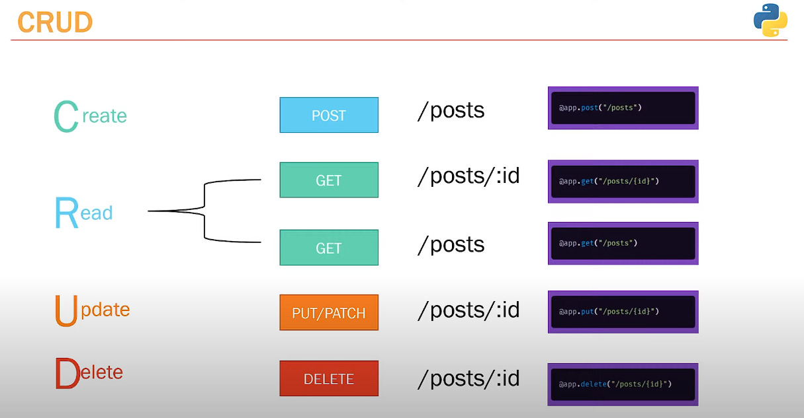

# Day 1 of FastAPI

- upto 1 hour 7 minute done
- basics of fast api
- in fastapi docs routes of node.js = path operations
- get and post method + postman

## Screenshot of postman create_post api

# Day 2 of FastAPI

- BaseModel, Optional field
- Creating my_posts array like a fake db
- Learn about REST pattern
- model.dump() replaced .dict() to convert pydantic model to py dictionary
- using random number using randrange(initial,max)
- Fast API automatically searialize array to json
- path paramter and response status
- HttpException

## Screenshot of REST

